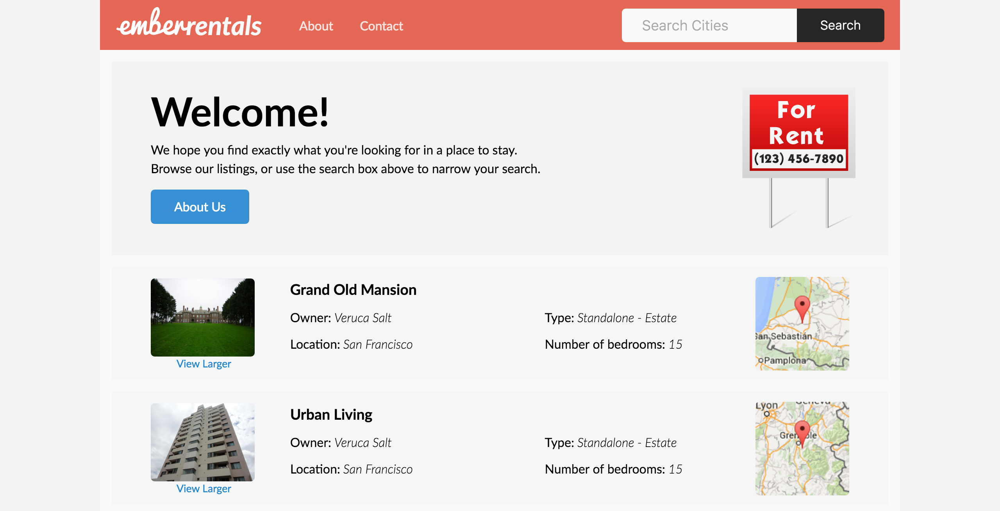
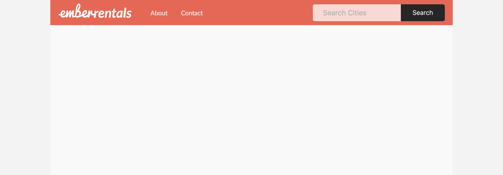
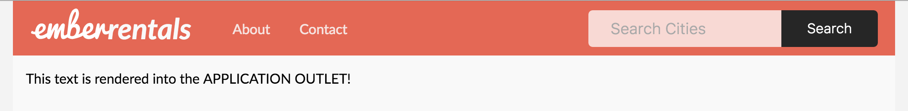
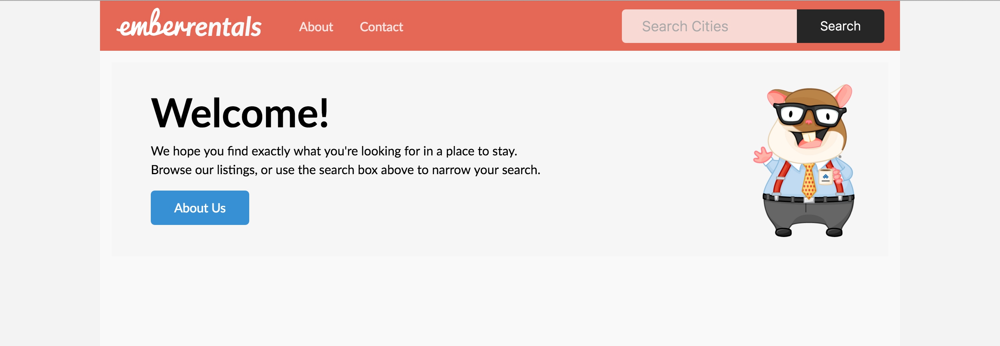
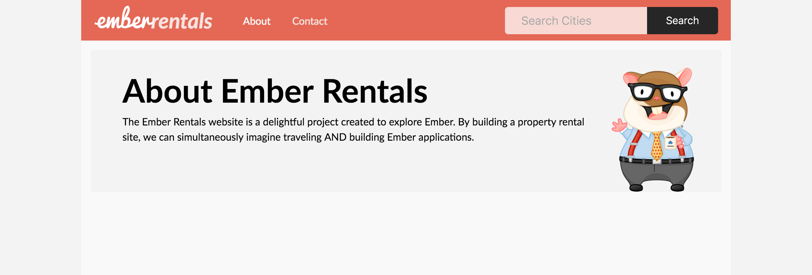
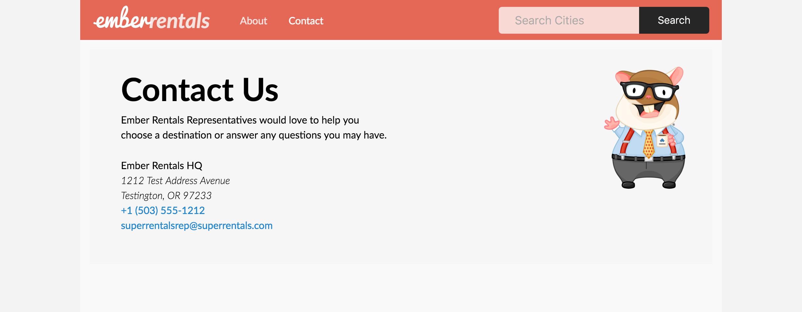
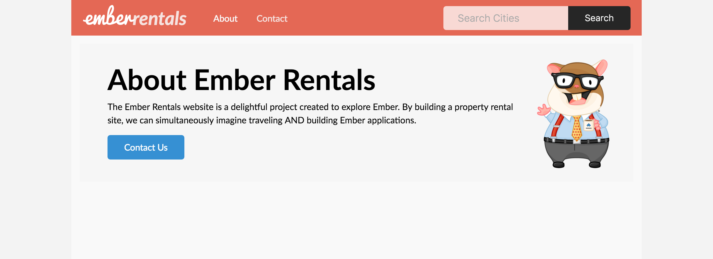

To demonstrate the basic setup and processing of an Ember application, this section will walk through building an Ember application for a property rental site called `Ember Rentals`.
It will start with a homepage, an about page and a contact page.
Let's take a look at the application from the user perspective before we get started.


<sub style="display:block;text-align:center">This is a preview of the application we are going to create.</sub>

We arrive at the home page which shows a list of rentals.
From here, we will be able to navigate to an about page and a contact page.

Let's make sure we have a fresh Ember CLI app called `ember-rentals` by running:

```shell
ember new ember-rentals
```

This will create a new directory, `ember-rentals`, which contains our application. Each time we create a new Ember-CLI application, we need to move into that directory before we can continue working on our application.

```shell
cd ember-rentals
```

Before we start building the three pages for our app,
we are going to clear out the contents of the `app/templates/application.hbs` file
and only leave the `{{outlet}}` code in place.
We'll talk more about the role of the `application.hbs` file after our site has a few routes.

Now, let's start by building our "about" page.
Remember, when the URL path `/about` is loaded,
the router will map the URL to the route handler of the same name, _about.js_.
The route handler then loads a template.

## The Application Template

The application template can contain whatever you wish, but generally, these elements appear on each page of your application. So, if for example your application has a navigation bar (which almost never disappears), the application template is a good place for the markup you'll need to render it.

For our application, we're going to add the following markup to our `app/templates/application.hbs` file, replacing the default markup;

```app/templates/application.hbs
<div class="container">
    <div class="menu">
        <h1 class="left">
            
            <em>rentals</em>
        </h1>
        <div class="left links">
            <a href="#">About</a>
            <a href="#">Contact</a>
        </div>
        <div class="right relative">
            <input class="light" type="text" placeholder="Search Cities">
            <button class="button light">Search</button>
        </div>
    </div>
    <div class="body">
        {{outlet}}
    </div>
</div>
```



<sub style="display:block;text-align:center">This is our Application View, without anything rendered into it.</sub>


## Outlets

While all of the HTML markup in our `application.hbs` template might already be familiar to you, the `{{outlet}}` is probably new. This is how Ember renders child templates into their parent templates. In the parent template, an `{{outlet}}` specifies where the child template will be inserted, or **rendered**. Then, when anyone navigates to a child route in your application, they will see both the application, and the child view (rendered into the application view).


## Generating our first route

By default, when you visit the `/` page of your application, the index route is rendered into the `{{outlet}}`.

But first, we will need to generate our index route, along with our index template! 

Since technically an ember application could exist with only one page, this is not created for us by default. So, we will need to use the `generate` command to add it.

If we run `ember help generate`, we can see a variety of tools that come with Ember for automatically generating files for various Ember resources.
Let's use the route generator to create our `index` route.

```shell
ember generate route index
```

or for short,

```shell
ember g route index
```

We can then see what actions were taken by the generator:

```shell
installing route
  create app/routes/index.js
  create app/templates/index.hbs
updating router
  add route index
installing route-test
  create tests/unit/routes/index-test.js
```

Three new files are created: one for the route handler, one for the template the route handler will render,
and a test file.
The fourth file that is touched is the router.

```app/router.js
import Ember from 'ember';
import config from './config/environment';

const Router = Ember.Router.extend({
  location: config.locationType
});

Router.map(function() {
});

export default Router;
```

By default, the `index` route handler loads the `index.hbs` template.
This means we don't actually have to change anything in the new `app/routes/index.js` file for the `index.hbs` template to render as we want.

Unlike other child routes you will generate, the `index` route is special:
it does NOT require an entry in the router's mapping.
We'll learn more about why the entry isn't required when we look at nested routes in Ember.

With all of the routing in place from the generator, we can get right to work on coding our template.

Let's demonstrate how the `index.hbs` template gets rendered into the application template by placing a small message inside our `index.hbs` file.

```app/templates/index.hbs
This text is rendered into the APPLICATION OUTLET!
```




Now that you understand how outlets work, let's use the following markup to render a nice welcome message into our `index.hbs` route

```app/templates/index.hbs
<div class="jumbo">
    
    <h2>Welcome!</h2>
    <p>
        We hope you find exactly what you're looking for in a place to stay.
        <br>Browse our listings, or use the search box above to narrow your search.
    </p>
    <a href="#" class="button">About Us</a>
</div>
```


<sub style="display:block;text-align:center">This is the index page for our application.</sub>


## An About Route

You'll see in our example that we link to a couple of other pages: `About` and `Contact`.

Just like in our previous example, lets go ahead and create a route called `about`.

```shell
ember g route about
```

You'll notice that, just like in the above example, several files were added to our project. However, one additional thing happened, which is very interesting. 

If we look inside `router.js`, we will see:

```app/router.js
import Ember from 'ember';
import config from './config/environment';

const Router = Ember.Router.extend({
  location: config.locationType
});

Router.map(function() {
  this.route('about');
});

export default Router;
```

When we open the router, we can see that the generator has mapped a new _about_ route for us.
This route will load the `about` route handler.

For this tutorial, you won't need to make any modifications to the `router.js` file. But it's important to keep in mind where this file is located. In the future, when you learn about advanced routing concepts, you may need to modify this file by hand.

Now, we can open `app/templates/about.hbs` and add the following markup:


```app/templates/about.hbs
<div class="jumbo">
    
    <h2>About Ember Rentals</h2>
    <p>
        The Ember Rentals website is a delightful project created to explore Ember.
        By building a property rental site, we can simultaneously imagine traveling
        AND building Ember applications.
    </p>
</div>
```

Run `ember serve` (or `ember s` for short) from the shell to start the Ember development server,
and then go to `localhost:4200/about` to see our new app in action!


<sub style="display:block;text-align:center">This is the about page for our application.</sub>

## A Contact Route

Let's create another route with details for contacting the company.
Once again, we'll start by generating a route, a route handler, and a template.

```shell
ember g route contact
```

We see that our generator has created a `contact` route in the `app/router.js` file,
and a corresponding route handler in `app/routes/contact.js`.
Since we will be using the `contact` template, the `contact` route does not need any additional changes.

In `contact.hbs`, we can add the details for contacting our Ember Rentals HQ:

```app/templates/contact.hbs
<div class="jumbo">
    
    <h2>Contact Us</h2>
    <p>Ember Rentals Representatives would love to help you<br>choose a destination or answer
        any questions you may have.</p>

    Ember Rentals HQ
    <address>
        1212 Test Address Avenue<br>
        Testington, OR 97233
    </address>
    <a href="tel:503.555.1212">+1 (503) 555-1212</a><br>
    <a href="mailto:emberrentalsrep@emberrentals.com">superrentalsrep@superrentals.com</a>
</div>
```

Now we have completed our second route.
If we go to the URL `localhost:4200/contact`, we'll arrive on our contact page.


<sub style="display:block;text-align:center">This is the contact page for our application.</sub>

## Navigating with Links and the {{link-to}} Helper

We really don't want users to have to know our URLs in order to move around our site,
so let's add some navigational links at the bottom of each page.
Let's make a contact link on the about page and an about link on the contact page.

Ember has built-in **helpers** that provide functionality such as linking to other routes.
Here we will use the `{{link-to}}` helper in our code to link between routes:

```app/templates/about.hbs
<div class="jumbo">
    
    <h2>About Ember Rentals</h2>
    <p>
        The Ember Rentals website is a delightful project created to explore Ember.
        By building a property rental site, we can simultaneously imagine traveling
        AND building Ember applications.
    </p>
    {{#link-to 'index' class="button"}}
        Contact Us
    {{/link-to}}
</div>
```

The `{{link-to}}` helper takes an argument with the name of the route to link to, in this case: `contact`.
When we look at our about page, we now have a working link to our contact page.


<sub style="display:block;text-align:center">This is the about page for our application, with the addition of a link button.</sub>

Now, we'll add a link to our contact page so we can navigate from back and forth between `about` and `contact`.

```app/templates/contact.hbs
<div class="jumbo">
    
    <h2>Contact Us</h2>
    <p>Ember Rentals Representatives would love to help you<br>choose a destination or answer
        any questions you may have.</p>

    Ember Rentals HQ
    <address>
        1212 Test Address Avenue<br>
        Testington, OR 97233
    </address>
    <a href="tel:503.555.1212">+1 (503) 555-1212</a><br>
    <a href="mailto:emberrentalsrep@emberrentals.com">superrentalsrep@superrentals.com</a>

    {{#link-to 'about' class="button"}}
        About
    {{/link-to}}
</div>

```
